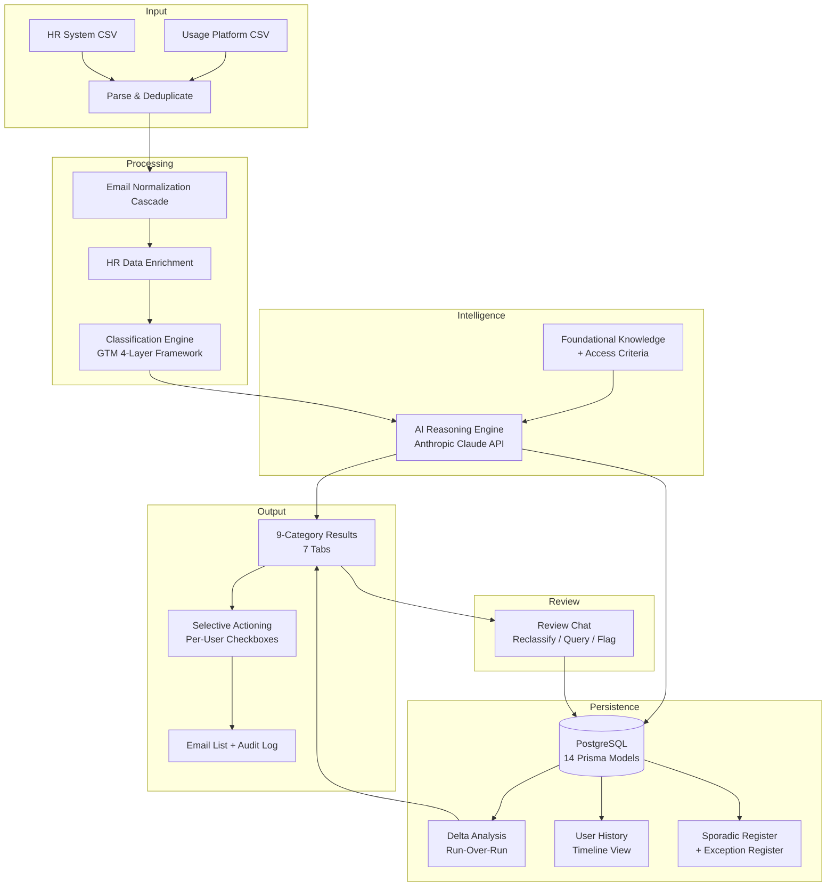

# SaaS License Clean-Up Agent

An AI-powered web application that automates the analysis phase of SaaS license clean-ups. Upload two CSVs, get every user classified into one of 9 categories with plain-English reasoning, review the output, and selectively confirm actions. The tool never removes users automatically.

> **Live demo:** [license-cleanup-agent.onrender.com](https://license-cleanup-agent.onrender.com) (free tier -- ~30s cold start)
> Login: `admin@company.com` / `changeme123` | Demo CSVs in [`demo/`](demo/)

---

## The Problem

Organizations running multiple SaaS instances face recurring license capacity constraints. When available seats run out, new hire onboarding is blocked until a clean-up frees capacity. The previous process required approximately two hours of manual work per cycle -- exporting data from a license management platform and an HR system, joining them by hand in spreadsheets, applying business rules from memory, and compiling removal lists. There was no audit trail, no consistent criteria, and the entire process relied on undocumented tacit knowledge. Every clean-up started from scratch.

---

## What It Does

The analyst uploads two CSV files -- a usage platform export (user activity and license data) and an HR system export (employee roster). The agent normalizes emails across formats and domains, enriches every user with full HR context, applies a configurable department classification framework, then sends the enriched data through an AI reasoning engine that classifies each user and writes a plain-English explanation.

Results appear across 7 tabs spanning 9 classification categories. The analyst reviews each user -- reading the reasoning, employee details, and activity signals -- then checks off the ones they accept for action. Only checked users appear in the final action list. Every accept and defer decision is logged with the analyst's identity and a timestamp.

On subsequent runs, the system automatically compares against the previous run for that instance, tagging each user as newly inactive, persistently inactive, recovered, reappeared, or net new. Review burden shrinks over time as the tool builds institutional memory.

---

## Architecture



**Input & Parsing** -- Two CSV files parsed in memory (never written to disk). HR system data is authoritative for all employee information.

**Email Normalization** -- 5-tier cascade resolving usage platform emails to canonical addresses for HR matching. Handles domain variants, plus-aliases, instance suffixes, legacy domains, and name-based fallback.

**HR Enrichment** -- Joins department, title, manager, division, product, worker type, and leave status onto every user from the HR roster.

**Classification Engine** -- 10-step deterministic precedence chain with a 4-layer department classification framework (Division > Department > Business Title > Product alignment) that protects revenue-facing users from automated removal.

**AI Reasoning** -- Validates and refines deterministic pre-classifications, assigns confidence levels, and writes per-user plain-English reasoning. Batches users (25 per API call) to manage token limits. Falls back to deterministic-only classification when no API key is configured.

**Delta Analysis** -- Compares current run against the most recent previous run for the same instance. Tags each user with one of 5 delta categories so the analyst can prioritize review.

**Persistence** -- 14 Prisma models storing runs, results, user history events, sporadic flags, prior exceptions, chat overrides, access criteria versions, and full audit trail.

See [`architecture/pipeline_architecture.md`](architecture/pipeline_architecture.md) for the full layer-by-layer breakdown.

---

## Key Features

- **AI-powered classification** -- per-user plain-English reasoning via Anthropic Claude API, with deterministic fallback when no API key is configured
- **Email normalization cascade** -- 5-mode resolution (instance suffix stripping, domain swapping, plus-alias handling, name-based fallback) to join usage data to HR records
- **Department classification framework** -- multi-layer classification using Division > Department > Business Title > Product alignment to protect revenue-facing users
- **Delta analysis** -- run-over-run comparison tracking newly inactive, persistently inactive, recovered, reappeared, and net new users
- **Selective actioning** -- per-user checkboxes with every accept/defer decision logged for audit
- **Sporadic access register** -- flags users with temporary/project-based access patterns, tracks removal and re-provisioning history
- **User history timeline** -- per-user panel showing all past analysis appearances, actions, flags, and chat overrides
- **Review chat** -- post-analysis conversation for reclassifying users, adding exceptions, flagging sporadic users, and querying results
- **Living access criteria** -- per-instance criteria documents with versioning and AI-assisted updates
- **System onboarding** -- self-serve flow for adding new SaaS systems; upload a CSV, review the AI-generated reasoning table, confirm, and the system goes live

---

## Tech Stack

| Layer | Technology |
|---|---|
| Backend | TypeScript, Express 5, Node.js |
| Frontend | React 19, Vite |
| Database | PostgreSQL 15, Prisma ORM (14 models) |
| AI | Anthropic Claude API (optional -- deterministic fallback) |
| Auth | Email/password with signed tokens + role-based authorization |
| Deployment | Docker (multi-stage build), Render |

**~8,000 lines** of TypeScript/React/CSS across 10 API route files, 7 core pipeline modules, 2 intelligence modules, and 13 React components.

---

## Design Decisions

- **Conservative by design** -- borderline cases route to Human Review. The cost of a wrong removal (disrupted employee, re-provisioning, escalation) exceeds the cost of a missed removal (one extra license seat). The deterministic fallback classifies all users as Human Review when AI is unavailable rather than guessing.
- **Selective actioning over bulk** -- the analyst curates the action list user by user. Every accept and defer is logged with identity and timestamp. No bulk "remove all" button exists by design.
- **AI is optional** -- the full analysis pipeline runs without an API key using deterministic classification. AI adds confidence levels, refined classifications, and plain-English reasoning -- but the system is functional without it.
- **HR-system-primary** -- HR data is the authoritative source for all employee information, overriding usage platform fields. The usage platform's built-in employee roster check is unreliable and never used.
- **Planning as infrastructure** -- four living documents (`CLAUDE.md`, `ARCHITECTURE.md`, `PRD.md`, `RULES_DECISION_TABLE.md`) maintained throughout the build. `CLAUDE.md` is auto-loaded by Claude Code every session, ensuring context is never lost between development sessions.

---

## Getting Started

### Prerequisites

- Docker and Docker Compose
- (Optional) Anthropic API key for AI-powered classification

### Quick Start

```bash
git clone https://github.com/mahdeen-reza/license-cleanup-agent.git
cd license-cleanup-agent

cp .env.example .env
# Edit .env if you have an Anthropic API key

docker compose -f docker-compose.yaml -f docker-compose.dev.yaml up
```

App runs at `http://localhost:3000`. PostgreSQL at `localhost:5432`. Prisma migrations and seed data run automatically on startup.

Default login: `admin@company.com` / `changeme123`

### Without Docker

```bash
npm install
npx prisma migrate deploy
npx prisma db seed
npm run build
npm start
```

Requires a running PostgreSQL instance and `DATABASE_URL` in `.env`.

---

## Demo Data

The [`demo/`](demo/) directory contains two CSVs for a complete analysis cycle on Instance B (Standard mode, Routine cleanup):

- **usage_platform_instance_b.csv** -- 37 users with license metadata and activity signals
- **hr_system_export.csv** -- 34 employee records (active, terminated, and ambiguous)

### Running the Demo

1. Log in with `admin@company.com` / `changeme123`
2. Upload both CSVs from `demo/` (select Instance B, Standard mode, Routine)
3. Run analysis -- 37 users classified across all 9 categories
4. Review results across 7 tabs, check users for action
5. Open User History panel on any row
6. Try the Review Chat to reclassify or query results

The demo data exercises every classification category and includes edge cases: Tier 3 name matching, instance suffix normalization, legacy email domain resolution, active prior exceptions, discrepant activity signals, and cross-instance product mismatches. See [`demo/README.md`](demo/README.md) for full expected results.

---

## Project Status

**Phase 1 is complete.** The system covers a single platform across 5 instances with full analysis, actioning, delta analysis, user history, review chat, and access criteria management.

**Phase 2 infrastructure is built.** The self-serve system onboarding flow -- upload a CSV, review an AI-generated reasoning table, confirm -- is implemented and ready. Phase 2 unlocks expansion to additional SaaS systems without engineering work.

---

## A Note on This Repository

This is a sanitized portfolio version of an internal tool built for a SaaS company. Business rules, organizational structures, and company-specific logic have been generalized. Instance names, department structures, and product names are anonymized. The original system is in production use.

---

## License

[MIT](LICENSE)
