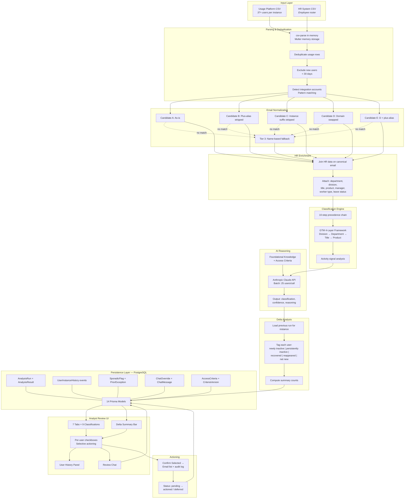

# Pipeline Architecture

A full-stack web application that processes two CSV uploads through a 16-step analysis pipeline, classifies every user into one of 9 categories with AI-generated reasoning, and presents results for selective analyst review. Single-container deployment: React SPA served by Express, PostgreSQL for all persistence.

---

## System Architecture



---

## Layer-by-Layer Breakdown

### 1. Input & Parsing

Two CSV files uploaded via the browser. Multer handles multipart form data with memory storage -- CSV content is parsed directly from buffers and never written to disk.

**Usage Platform Export** contains user activity and license data: email, username, directory fields, activity dates, days-active counts, permission sets, profile, and license metadata. The same schema applies across all 5 instances.

**HR System Export** contains the full employee roster: work email, name, employment status, termination date, department, division, business title, product assignment, manager, region, worker type, and acquisition company (for legacy employees).

The HR system is the authoritative source for all employee information. Usage platform fields for department, title, and roster status are overridden by HR data wherever a match exists.

**Files:** [hrEnricher.ts](../src/core/hrEnricher.ts) (279 lines -- CSV parsing + enrichment), [analysis.ts](../src/routes/analysis.ts) (611 lines -- pipeline orchestration)

### 2. Email Normalization Cascade

A direct email join between the usage export and HR roster fails for 20-30% of users in a typical dataset. The normalization cascade resolves this through a 5-candidate sequence plus a name-based fallback:

| Tier | Candidate | Resolution |
|---|---|---|
| 1 | **A** -- Email as-is | `user@company.com` matched directly |
| 1 | **B** -- Plus-alias stripped | `user+tag@company.com` → `user@company.com` |
| 1 | **C** -- Instance suffix stripped | `user.instanceb@company.com` → `user@company.com` |
| 1 | **D** -- Domain swapped | `user@legacy.com` → `user@company.com` |
| 1 | **E** -- D + plus-alias stripped | `user+tag@legacy.com` → `user@company.com` |
| 3 | **Name match** | First + last name from directory fields matched against HR roster |

Candidates are tried in order. First match wins. Tier 3 name matches are flagged (`nameMatchFlag=true`) so the analyst can verify -- the system never auto-actions on an ambiguous identity resolution.

**Six resolution statuses:**
- `MATCHED` -- canonical email found (Tier 1 or 3)
- `INTEGRATION` -- detected as service/integration account
- `EX_EMPLOYEE` -- partial match resolves to terminated HR record
- `LEGACY_UNRESOLVED` -- legacy domain, no HR match
- `AMBIGUOUS` -- name match produced multiple candidates
- `UNRESOLVED` -- no match found

**File:** [emailNormalizer.ts](../src/core/emailNormalizer.ts) (275 lines)

### 3. HR Data Enrichment

Every usage export row gets enriched with full HR context from the matched record:

| Field | Source | Purpose |
|---|---|---|
| Department | HR system | Classification framework Layer 2 |
| Division | HR system | Classification framework Layer 1 |
| Business Title | HR system | Classification framework Layer 3 |
| Product | HR system | Instance product alignment (Layer 4) |
| Manager Email | HR system | GTM escalation routing |
| Worker Type | HR system | Contractor/employee distinction |
| On Leave | HR system | Context for borderline cases |
| Region | HR system | Geographic context |
| Active/Inactive Status | HR system | Employment verification |
| Termination Date | HR system | Ex-employee detection |
| Acquisition Company | HR system | Legacy email resolution |

The enrichment step builds two lookup maps (by email and by name) from the HR roster for O(1) resolution during the normalization cascade.

**File:** [hrEnricher.ts](../src/core/hrEnricher.ts) (279 lines)

### 4. Classification Engine

A deterministic 10-step precedence chain classifies every user before AI sees them. First matching rule wins:

| Step | Rule | Classification | Tab |
|---|---|---|---|
| 1 | Created within 30 days | Excluded (New User) | Excluded |
| 2 | Matches integration pattern | Excluded (Integration) | Excluded |
| 3 | HR shows terminated/inactive | Ex-Employee | Ex-Employee |
| 4 | Normalization status ambiguous/unresolved | Unresolved or Human Review | Human Review |
| 5 | In prior exception register + inactive | Prior Exception | Prior Exception |
| 6 | In protected department | Human Review | Human Review |
| 7 | GTM framework → cross-instance anomaly | Cross-Instance Anomaly | GTM Flagged |
| 8 | Activity signals discrepant | Human Review | Human Review |
| 9 | Within inactivity threshold | Excluded (Active) | Excluded |
| 10 | Inactive, non-GTM | Direct Remove or Notify First | Direct Remove / Notify First |

**GTM 4-Layer Framework:**

```
Layer 1 — Division
  Sales → GTM (all departments)
  CEO / Marketing / Operations / Product / Technology → Non-GTM
  Customers → Layer 2

Layer 2 — Department (Customers division only)
  Support → Non-GTM
  Protected departments → Human Review (always)
  Engagement / Field Support / Launch Services / Professional Services → Layer 3

Layer 3 — Business Title keyword scan
  GTM titles: Account Manager, Customer Success, Implementation Consultant,
  Launch Manager, Onboarding Specialist, Solutions Consultant, etc. (21 patterns)
  Non-GTM titles: Support Specialist/Associate/Manager/Representative (5 patterns)
  Unknown → Human Review

Layer 4 — Instance Product Alignment (non-Instance A only)
  GTM + matching product → Standard GTM protection
  GTM + non-matching product → Cross-Instance Anomaly
  Instance A → No product filter (all products expected)
```

**Activity Signal Analysis:**

Three clean-up modes with different inactivity thresholds:

| Mode | Threshold | Use Case |
|---|---|---|
| Standard | 60+ days inactive | Routine monthly clean-up |
| Urgent | 30+ days inactive | License shortage, deadline |
| Critical | No threshold | All users reviewed |

Instance A uses a restricted signal set (`sfLastActivityDate`, `platformLastDate`, `sfDaysActive`, `platformDaysActive`) because the primary `lastActivityDate` field is skewed by third-party integration logins. All other instances use all 6 activity fields.

**File:** [classifier.ts](../src/core/classifier.ts) (632 lines)

### 5. AI Reasoning Engine

Takes the deterministic pre-classification for every user and sends it to the Anthropic Claude API for validation, refinement, and reasoning generation.

**System context includes:**
- Foundational knowledge (9-category framework, classification rules, conservative principles)
- Instance-specific access criteria (if reviewed and stored from previous runs)
- Prior exception register entries
- Current run configuration (instance, mode, thresholds)

**Per-batch prompt includes:**
- Up to 25 enriched users with all HR context and activity signals
- Deterministic pre-classification and match tier for each user
- Sporadic flag context where applicable

**AI output per user:**
- Classification (validated or refined from pre-classification)
- Confidence level: `high`, `medium`, or `low`
- Reasoning: 1-2 sentence plain-English explanation

**Fallback behavior:** When `ANTHROPIC_API_KEY` is not set, `isAIConfigured()` returns false and the pipeline skips AI entirely. All users receive their deterministic classification with `human_review` confidence and a note that AI was unavailable. The system is fully functional without AI -- the intelligence layer adds nuance, not core capability.

**Files:** [reasoningEngine.ts](../src/intelligence/reasoningEngine.ts) (325 lines), [foundationalKnowledge.ts](../src/intelligence/foundationalKnowledge.ts) (157 lines), [ai.ts](../src/lib/ai.ts) (51 lines)

### 6. Delta Analysis

After classification, the pipeline compares the current run against the most recent previous run for the same instance. Comparison is at the email level, always instance-scoped.

**Five delta categories:**

| Category | Meaning | Analyst Priority |
|---|---|---|
| Newly Inactive | Active or absent last run, now meets inactivity threshold | High -- fresh review needed |
| Persistently Inactive | Flagged in both previous and current run | Medium -- analyst has seen them before |
| Recovered | Flagged previously, now showing activity | Low -- self-corrected |
| Reappeared | Actioned for removal previously, now back in export | High -- investigate re-provisioning |
| Net New | First appearance in any run for this instance | Context -- not same as "new user" by creation date |

**Baseline detection:** If no previous run exists for this instance, delta is skipped and all users are tagged with null delta category.

**Mode mismatch warning:** If the previous run used a different threshold (e.g., Urgent vs Standard), the UI displays a warning that delta comparisons may reflect threshold changes rather than actual user behavior changes.

Summary counts (per category) are stored on the `AnalysisRun` record and displayed in the Delta Summary Bar.

**File:** [deltaComparison.ts](../src/core/deltaComparison.ts) (261 lines)

### 7. Actioning & Audit Trail

The analyst reviews results across 7 tabs. Every row has a checkbox. The analyst reads the reasoning, employee details, and activity signals, then checks off users they accept for action.

**Action statuses:**
- `pending` -- not yet reviewed (default after analysis)
- `actioned` -- analyst confirmed for action (generates email list entry)
- `deferred` -- analyst reviewed and intentionally skipped

Clicking "Confirm Selected" on a tab:
1. Generates a copyable email list from checked users only
2. Marks each checked user as `actioned` in the database with timestamp and analyst email
3. Marks unchecked users as `deferred`
4. Writes audit events to `UserInstanceHistory`
5. Increments `SporadicFlag.removalCount` for any flagged users being actioned

**File:** [actionTracker.ts](../src/core/actionTracker.ts) (134 lines)

### 8. Persistence Layer

Fourteen Prisma models organized around three concerns:

**Configuration:**
- `System` -- represents a SaaS platform (name, description, instance configs)
- `InstanceConfig` -- per-instance settings (thresholds, product alignment, scope)
- `ReasoningTable` -- AI-generated classification framework per system (JSON, versioned)
- `IntegrationPattern` -- service account detection patterns
- `AppUser` -- authorized users with roles (admin, standard)

**Analysis Data:**
- `AnalysisRun` -- single analysis invocation (instance, mode, who ran it, result counts, delta summary)
- `AnalysisResult` -- per-user classification (all HR fields, activity fields, classification, confidence, reasoning, action status, delta category)
- `PriorException` -- documented business justifications for keeping specific users
- `SporadicFlag` -- temporary/project-based access patterns per user per instance

**History & Audit:**
- `UserInstanceHistory` -- event log per user per instance (analysis appearances, actions, flags, overrides)
- `ChatOverride` -- record of analyst reclassifications via review chat
- `AccessCriteria` -- per-instance criteria documents (JSON, versioned)
- `CriteriaVersion` -- version history of criteria changes with author and change notes
- `ChatMessage` -- conversation history for review chat and criteria chat

**File:** [schema.prisma](../prisma/schema.prisma)

### 9. User History & Institutional Memory

Three features compound institutional memory across runs:

**User History Timeline** -- clicking any user row opens a side panel assembling their complete history on this instance from 5 data sources: `UserInstanceHistory` events, `AnalysisResult` appearances, `SporadicFlag` records, `PriorException` entries, and `ChatOverride` records. Shows every past classification, every action taken, every flag, and every chat-driven change.

**Sporadic Access Register** -- separate from the prior exception register. Prior exceptions say "don't remove -- standing business need." Sporadic flags say "remove when inactive, but this user has a pattern of temporary/project-based access." The flag provides context (removal count, re-provisioning history) without protecting the user from removal. Per-instance scoped -- a user can be sporadic on one instance but permanent on another.

**Review Chat** -- post-analysis conversational interface for reclassifying users, adding exceptions, flagging sporadic users, and querying results. Every interaction is logged. Chat-driven knowledge (sporadic flags, team-level rules, reclassification reasons) persists into future runs automatically.

**Files:** [userHistoryService.ts](../src/core/userHistoryService.ts) (250 lines), [sporadicFlagService.ts](../src/core/sporadicFlagService.ts) (192 lines)

---

## 9 User Classifications

| Classification | Tab | Action | Trigger |
|---|---|---|---|
| Direct Remove | Direct Remove | Submit support ticket | Non-GTM, inactive beyond threshold, no borderline signals |
| Notify First | Notify First | Notification, then 5-7 day window | Inactive but has borderline signals (permission sets, low activity) |
| Ex-Employee | Ex-Employee | Priority ticket -- offboarding failure | HR shows terminated but user still in usage platform |
| GTM -- Consult Required | GTM Flagged | Consult manager before action | Revenue-facing user (per GTM framework), inactive |
| Cross-Instance Anomaly | GTM Flagged | Verify business need | GTM user whose product doesn't match instance expectation |
| Prior Exception | Prior Exception | Show justification, human decides | In exception register and currently inactive |
| Human Review | Human Review | Human verifies borderline case | Protected department, discrepant signals, ambiguous match, unknown division |
| Excluded | Excluded | Never action | Active users, new users (< 30 days), integration accounts |
| Unresolved | Human Review | Manual investigation | No HR record match (email, name, or local-part) |

---

## Frontend Architecture

13 React components totaling ~3,500 lines, organized around 5 views:

| View | Components | Purpose |
|---|---|---|
| Analysis | RunConfig, AnalysisResults, DeltaSummaryBar, ReviewChat, UserHistoryPanel | Core workflow -- configure, run, review, action |
| Onboard | SystemOnboarder, ReasoningTableReview | Self-serve system onboarding (Phase 2) |
| Knowledge | KnowledgeBase | Access criteria management with versioning |
| History | RunHistory | Past runs with click-to-load detail |
| Admin | AdminConsole | User management (admin role only) |

**Auth state machine** in App.tsx routes between 4 states: loading, unauthenticated (LoginPage), authenticated (main app), denied (AccessDenied).

**Styling:** Dark theme via inline styles + single global CSS file ([index.css](../frontend/src/index.css)). No CSS-in-JS or component library.

**API client:** Simple fetch wrapper ([api.ts](../frontend/src/lib/api.ts)) with Bearer token management via localStorage.

---

## Deployment

**Docker:** Multi-stage build (Node 20 slim). Build stage compiles TypeScript backend, builds React frontend, generates Prisma client. Production stage runs as non-root user. Single `EXPOSE 8000`.

**Startup command:** `prisma migrate deploy && prisma db seed && node dist/server.js` -- idempotent, safe on every deploy and restart. Migrations and seed data apply automatically.

**Render (free tier):** render.yaml Blueprint auto-provisions PostgreSQL database and web service. `DATABASE_URL` injected from linked database. `TOKEN_SECRET` auto-generated. Service spins down after 15 minutes of inactivity (~30s cold start on next request).

**Local dev:** `docker compose -f docker-compose.yaml -f docker-compose.dev.yaml up` with host port bindings and hot reload via bind mounts.
